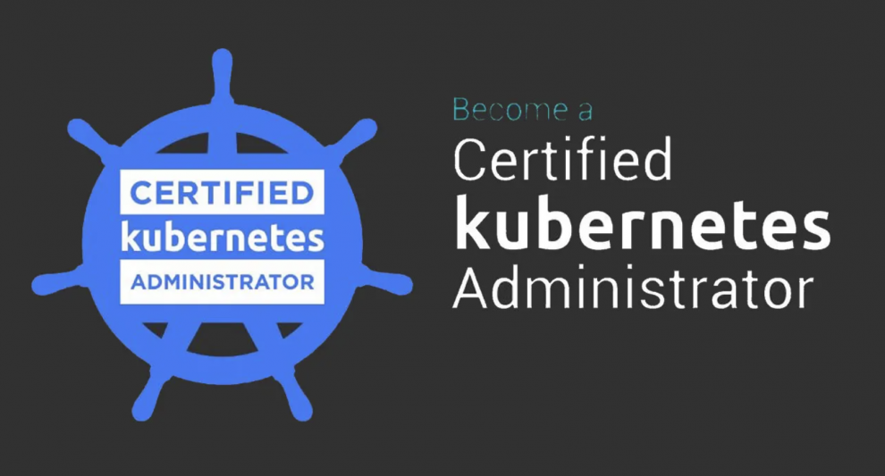

# cka-lab
This repo contains set of practice questions which will help you to get ready for the cka exam

# *Certified Kubernetes Administrator (CKA) Pratice Lab*

## About this Practice lab questions:

With reference to multiple materials and googling I came up with set of best scenairos which will make one to get ready to face the cka exam. 

> Note this is not the exact exam questions, use this for the practice purpose. Also refer this only after getting your concepts cleared.    :+1:

### Description

_In this lab questions your Kubernetes skills will be tested. There are in total 25 questions with some real time use cases. By practicing this you can gain the experience to face the Certified Kubernetes Administrator (CKA) exam. Note: I have just covered topics that are specific to only the *CKA certification exam* by considering the new exam pattern._

### Lab Setup

You can create 1 master and 2 node cluster with kubeadm.

- To create a k8s cluster using kubeadm, refer the steps from link [Kubeadm](https://kubernetes.io/docs/setup/production-environment/tools/kubeadm/install-kubeadm/)
- For sample testing you can also try, play_with_kubernetes to spin up the cluster. But consider you wont be able to try couple of scenarios [playwithk8s](https://labs.play-with-k8s.com/)

### Content

I have created 25 task along with solutions for all the questions. I would highly recommened to try the scenarios by yourself without the help of solution provided. But you can refer to cross-check your answer.

Pls feel free to poke if you find any mistake or if you know any other better way to solve the questions.

# Follow-Me

:id: :sparkles: 

